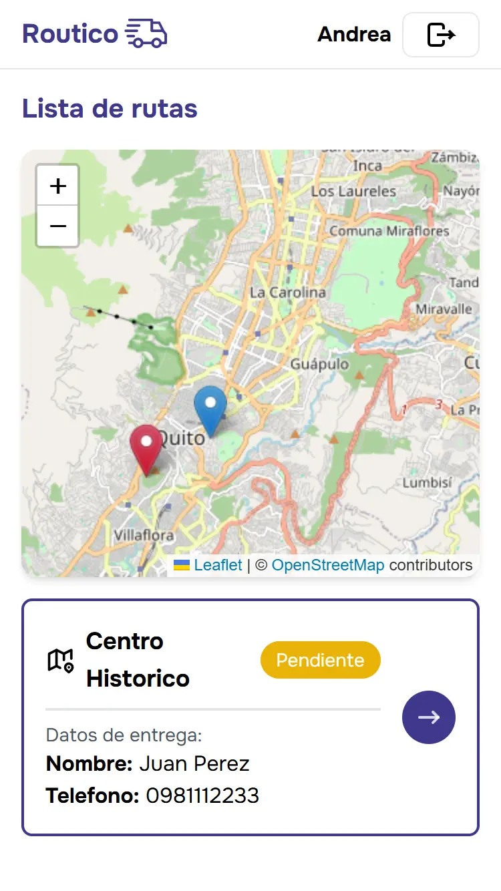

# Routico

**Routico** es una aplicación web diseñada para optimizar la planificación y gestión de rutas de entrega. Permite la creación y administración de conductores, asignación de rutas personalizadas y seguimiento eficiente de las entregas.

#### Panel Administrativo

#### Panel Conductor

## Características

- **Interfaz Amigable:** Diseñada para ser fácil de usar tanto en escritorio como en dispositivos móviles.
- **Gestión de rutas personalizadas**: Crea, edita y asigna rutas según las necesidades de entrega.
- **Administración de conductores**: Registra y gestiona conductores con credenciales seguras.
- **Mapas interactivos:** Visualización de rutas en mapas dinámicos.
- **Historial de rutas:** Registro de rutas anteriores para referencia futura.
- **Generador de credenciales:** Genera usuario y contraseña para que los conductores accedan al panel de conductor y ver las rutas asignadas.

## Herramientas

- [Astro](https://astro.build/)
- [React](https://react.dev/)
- [Firebase](https://firebase.google.com/?hl=es-419)
- [TailwindCSS](https://tailwindcss.com/)
- [Leaflet](https://leafletjs.com/)
- [Vercel](https://vercel.com)
